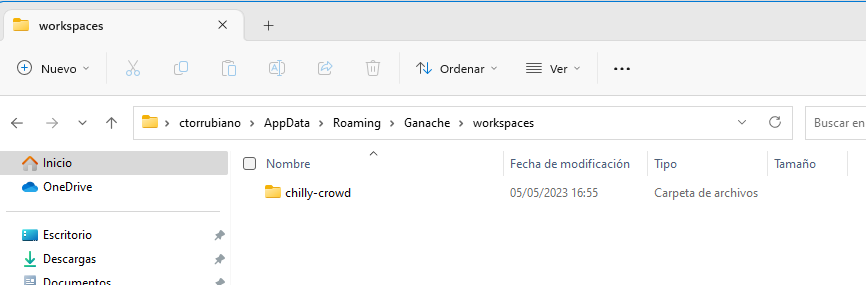
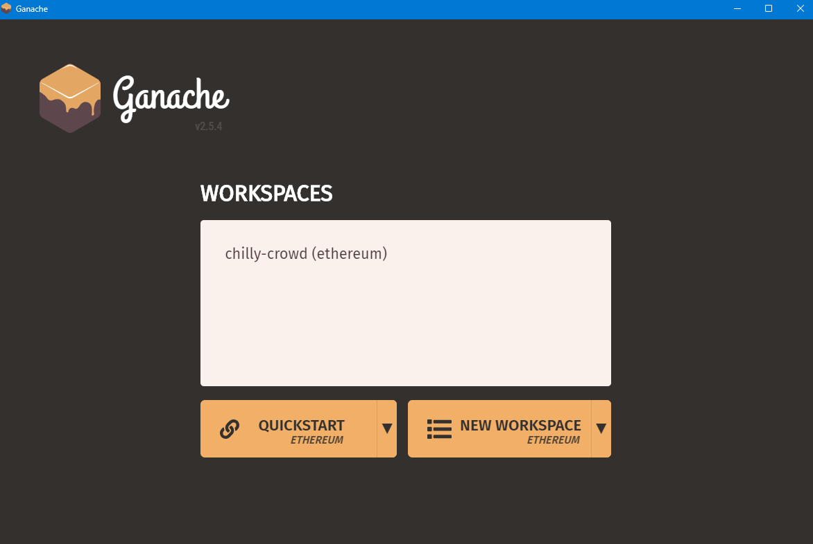
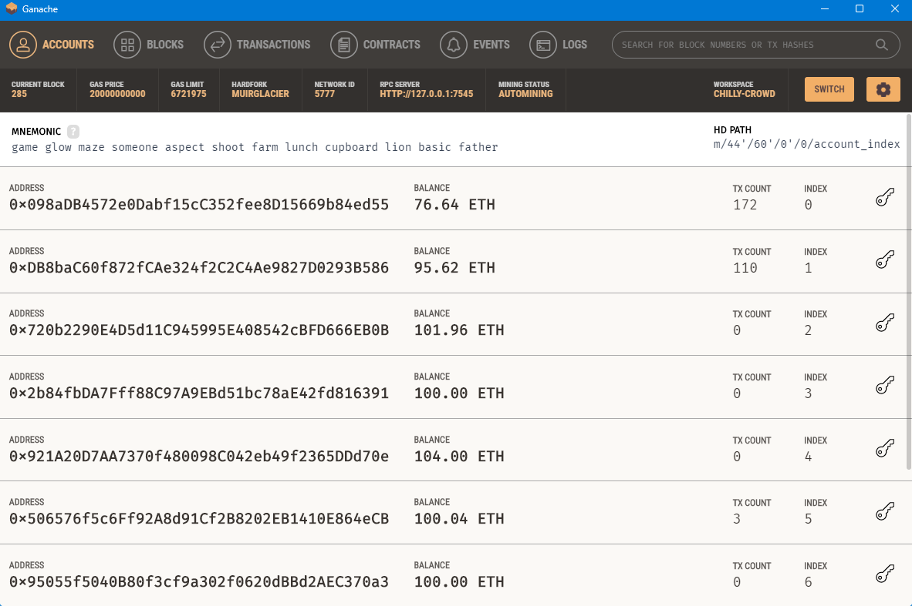
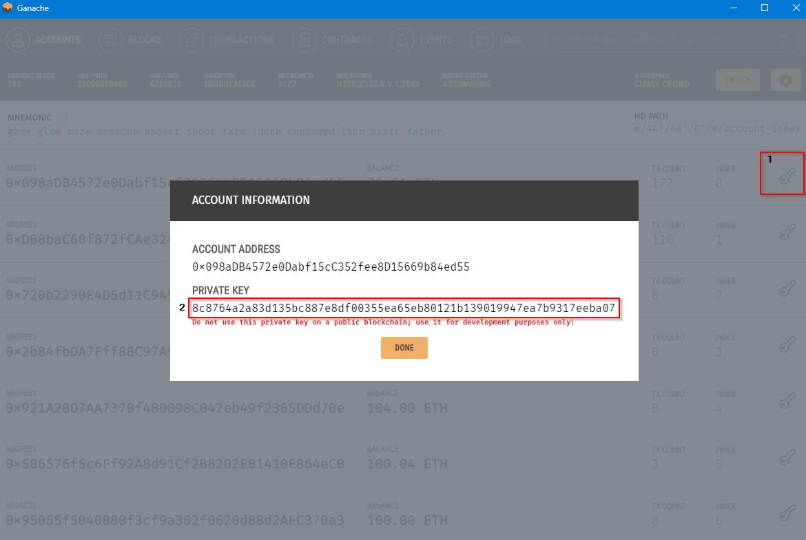
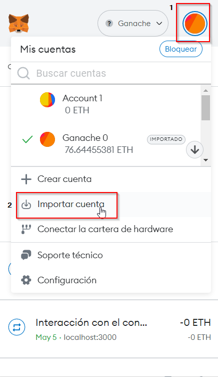
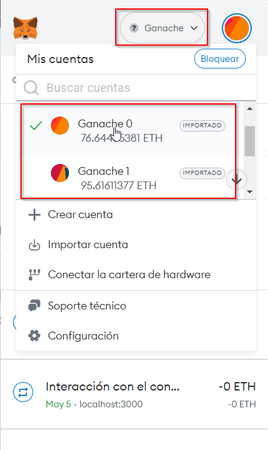

# Web3 Payment App (3Pay)

Autor: Carles Torrubiano Rubies

## Information
This repository contains different projects which are executed separately. More information and the instructions can be found in the READMEs for each of them separately.
The order for execute all and works propertly is:
1. api
2. client
3. react-shopping-cart

### Project structure
The following explains what is contained in each of the directories:

**1. api**

Although it is a web3 application , which implies that it is decentralised, it has an API which stores transactions as a cache to consult transactions more quickly and only those issued by the application.

**2. client**
This directory contains the main application of the project,** 3Pay**.

**3. react-shopping-cart**
This directory contains the project that simulates a small ecommerce, with some items from a public api and a shopping cart in order to see how the 3Pay application would be integrated with an ecommerce.

**4. truffle**
This directory contains the project created with the Truffle framework in which the smart contracts and the configuration and deployment scripts to the blockchain are located.

## Set up

### Before start
Before running the application, it uses [Metamask](https://metamask.io/ "Metamask") as a wallet and gateway to the blockchain. On the other hand, the application is intended to connect to different blockchains, but as it is currently a project for academic purposes, it uses [Ganache](https://trufflesuite.com/ganache/ "Ganache") as a local blockchain, which allows to have several Ethereum accounts with ETH, inspect how the blockchain operates, consult transactions, blocks, etc. without the need to worry about.

### Download
Below are the links where to download Metamask and Ganache.
- Metamask: https://metamask.io/download/ (browser extension)
- Ganache: https://trufflesuite.com/ganache/ (download)

### Install
#####  1. Ganache

##### 2. Metamask

### Configuration
#####  1. Ganache
Download and unzip the *"chilly-crowd.zip"* file. This file contains the blockchain data with transaction and block history, accounts and deployed smart contracts. 

Una vez descargado y descomprimido copiar la carpeta entera en `C:\Users\user\AppData\Roaming\Ganache\workspaces` (Windows).

This way when we open the Ganache application we should see the workspace, double click and be able to enter.

Once you enter the workspace you should see the following:

##### 2. Metamask
Once Metamask is installed you will need to follow the steps to create a wallet. This process is private as it asks for a security phrase, password, etc. so it is left to the user. The following explains how to add Ganache network and how to import the accounts.
**- Add network**

**- Import accounts**

1. Go to the Ganache application, choose the account you want to import into Metamask and click on the key icon and then copy the private key.

2. Go to the browser, open the Metamask extension, go to My Accounts > Import account and paste the private key copied earlier and hit import.

## Run

1. Abrir Ganache y entrar en el workspace copiado anteriormente y aseguarse que se esta ejecutando. Deberia ver lo siguiente:

2. Make sure you have Metamask installed in your browser Ganache network and accounts imported.

3. Run the api, client, react-shopping-cart directories as indicated in each directory separately and in the same order.

